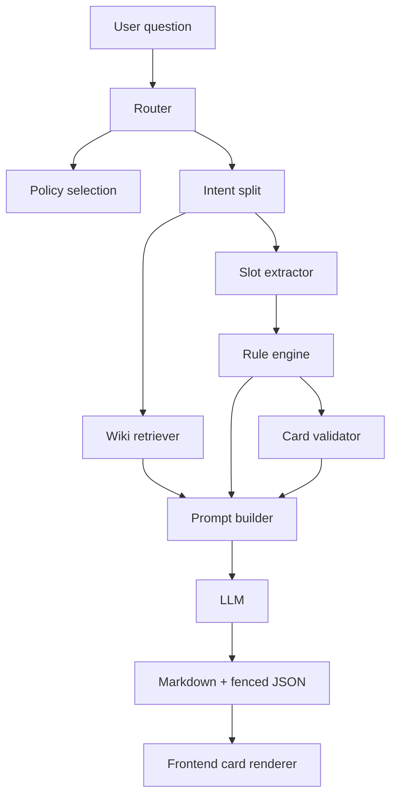

# Architecture



## Runtime Modes

### Fast Wiki

```text
orchestration result + selected wiki snippets -> LLM
```

Best for product usage.

### Full Skill

```text
SKILL.md + references + orchestration result -> LLM
```

Best for testing whether the full skill instructions are followed.

## Module Boundaries

| Module | Responsibility |
| --- | --- |
| `router.js` | policy version and intent detection |
| `slot-extractor.js` | structured field extraction |
| `rules.js` | deterministic insurance logic and card drafts |
| `wiki.js` | domain snippet retrieval |
| `prompt-builder.js` | MiniMax prompt construction |
| `validator.js` | card structure checks |
| `web/server.js` | HTTP, SSE, MiniMax proxy |
| `web/public/app.js` | browser UI and card rendering |

